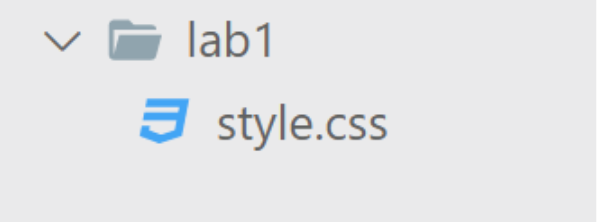
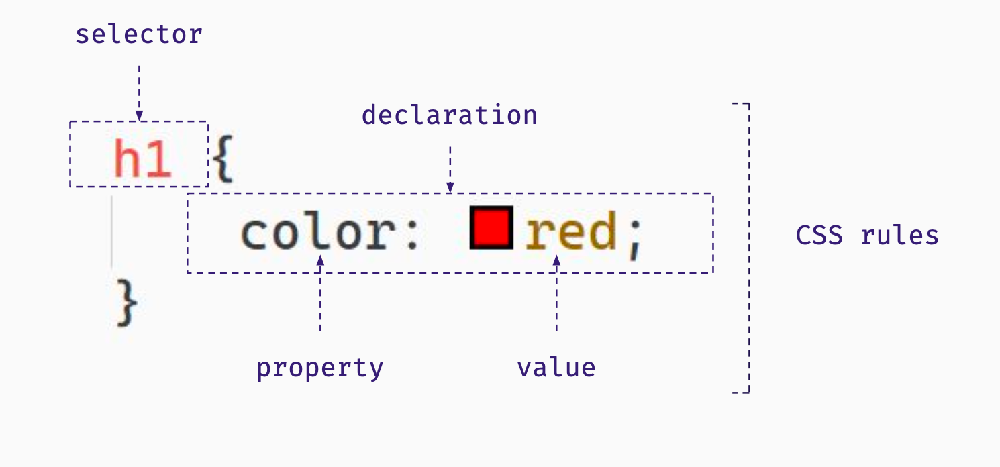
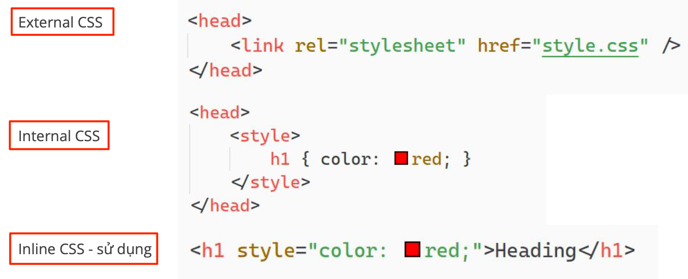

# CSS Basic

---

## CSS là gì?

CSS (Cascading Style Sheets - bảng định kiểu) được sử dụng để trang trí, tạo bố cục cho trang web CSS cũng là một ngôn ngữ đơn giản, nó bao gồm các bộ chọn (selectors) và các thuộc tính

(properties) để xác định cách các phần tử HTML hiển thị trên trang web Các tệp tin CSS có phần mở rộng **.css**




💡 Một trang web có thể có nhiều file CSS

##  Cú pháp CSS


 
💡 Các thuộc tính CSS được chia thành các module, tham khảo tại [w3schools](https://www.w3schools.com/css/default.asp)

##  Nhúng CSS vào HTML



## Các bộ chọn cơ bản


```css
/* Chọn tất cả phần tử trong trang theo tag name */
h1 {
    color : red;
}

/* Áp dụng CSS giống nhau cho nhiều bộ chọn */
p, li, a {
    font-size : 15px;
}
```

```css

```